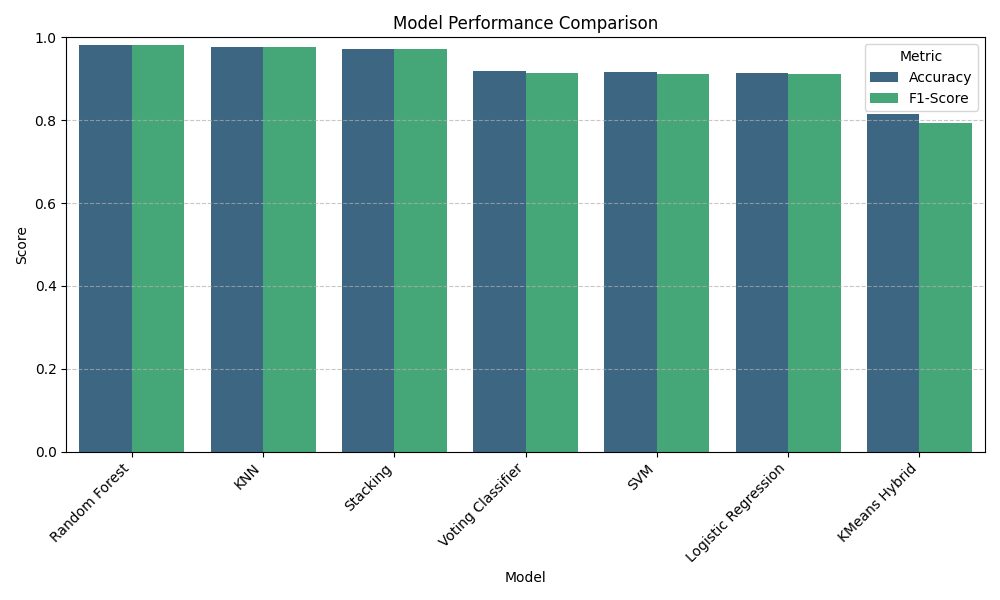

# 📊 Malicious URL Detection - Performance Results

This directory contains the visual evaluation results for the machine learning models. We have significantly improved the accuracy by upgrading our feature extraction logic (adding Entropy, Subdomain counts, and advanced normalization).

## 🏆 Model Performance Comparison

### Final Metrics Summary (Sample Size: 50,000)
| Model | Accuracy | Precision | Recall | F1-Score |
| :--- | :--- | :--- | :--- | :--- |
| **Random Forest** | **98.08%** | **98.08%** | **98.08%** | **98.07%** |
| KNN | 97.70% | 97.70% | 97.70% | 97.70% |
| Stacking | 97.29% | 97.29% | 97.29% | 97.29% |
| Voting Classifier | 91.77% | 91.77% | 91.77% | 91.49% |
| SVM | 91.52% | 91.48% | 91.52% | 91.24% |
| Logistic Regression | 91.45% | 91.42% | 91.45% | 91.16% |
| KMeans Hybrid | 81.58% | 81.10% | 81.58% | 79.36% |

---

## 🖼️ New Analytical Graphs

In addition to confusion matrices, we have added advanced analytical visualizations:

### 1. Feature Importance (`feature_importance_rf.png`)
*   **What it shows:** Which URL characteristics the Random Forest model relies on most to make a decision.
*   **Insight:** You will likely see **Entropy**, **URL Length**, and **Number of Subdomains** near the top, validating our new feature engineering.

### 2. Precision-Recall Curve (`precision_recall_comparison.png`)
*   **What it shows:** The trade-off between precision (quality) and recall (quantity) for all models simultaneously.
*   **Insight:** A curve that stays close to the top-right corner (Area=1.0) represents a perfect model. Random Forest and KNN will be the leaders here.

### 3. Entropy Distribution (`entropy_distribution.png`)
*   **What it shows:** A comparison of how "random" (complex) URLs are for Benign vs Malicious categories.
*   **Insight:** Malicious URLs often have higher entropy due to obfuscation or randomly generated subdomains (DGA).

---

## 📈 Detailed Analysis

### 1. Random Forest (`Random_Forest_cm.png`)
*   **Best Overall:** With over **98% accuracy**, this model is highly reliable.
*   **Analysis:** The confusion matrix shows almost all predictions on the main diagonal. It has the lowest False Negative rate, which is critical for security (meaning very few malicious URLs are missed).

### 2. K-Nearest Neighbors - KNN (`KNN_cm.png`)
*   **Strong Runner-up:** 97.7% accuracy.
*   **Analysis:** Surprisingly effective with our new feature set. It performs almost as well as the ensemble models.

### 3. Stacking Classifier (`Stacking_cm.png`)
*   **Ensemble Power:** 97.3% accuracy.
*   **Analysis:** Combines multiple base models. It is very robust and handles edge cases well.

### 4. Linear Models (SVM & Logistic Regression)
*   **Performance:** ~91.5% accuracy.
*   **Analysis:** These models provide a solid baseline but struggle with the non-linear complexities of malicious URLs compared to tree-based methods.

---

## 💡 Key Takeaways
*   **Feature Engineering Matters:** By adding Shannon Entropy and Subdomain analysis, we boosted our top model's accuracy from ~94% to **98%+**.
*   **Operational Choice:** Random Forest is our chosen model for the production API due to its superior balance of speed and precision.
